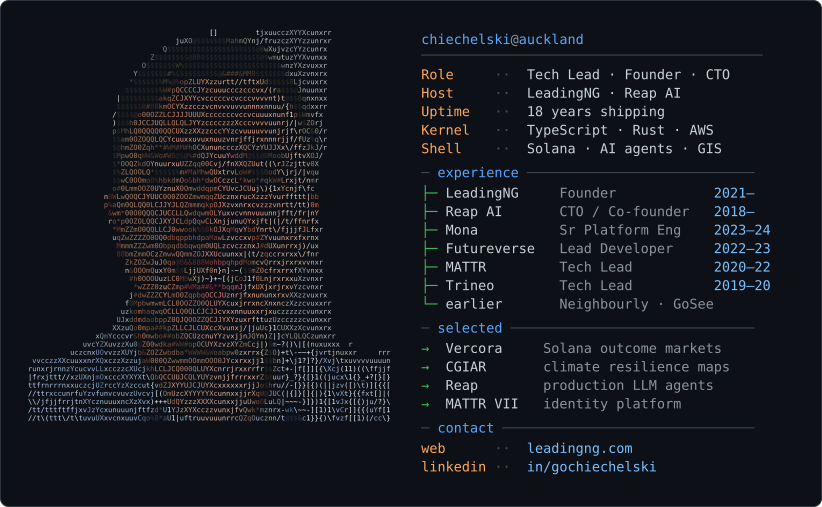

<picture>
  <source media="(prefers-color-scheme: dark)" srcset="profile-dark.svg" />
  <source media="(prefers-color-scheme: light)" srcset="profile-light.svg" />
  
</picture>

Hands-on technical lead. 18 years shipping identity, Web3, and AI platforms — architecture, delivery, and operability. Based in Auckland.

### Now

- **Founder**, [LeadingNG](https://www.leadingng.com) — client delivery across Solana, GIS, and product platforms
- **CTO / Co-founder**, [Reap AI](https://www.reapapp.io) — production LLM agents, Expo/React Native, AWS

### Selected work

| | |
| :--- | :--- |
| [**Vercora**](https://vercora.xyz/) | Solana outcome-markets protocol — Anchor program, TypeScript SDK, wallet-connected client |
| [**CGIAR**](https://climate-resilience-platform.org/) | Climate resilience mapping — MapLibre, Cloud Optimized GeoTIFF, PostGIS on AWS |
| [**Reap**](https://www.reapapp.io) | Production AI agents — RAG, tool calling, evals, and audit trails |
| [**MATTR VII**](https://www.mattr.global) | Led a team of 6 on the identity platform |

### Path

```text
2021–      Founder              LeadingNG
2018–      CTO / Co-founder     Reap AI
2023–24    Sr Platform Eng      Mona
2022–23    Lead Developer       Futureverse
2020–22    Tech Lead            MATTR
2019–20    Tech Lead            Trineo / Fisher Funds
2018–19    Tech Lead            Longboard Games
2014–17    Senior PHP           Neighbourly
2010–14    Senior PHP / Lead    GoSee Travel
```

### Stack

`TypeScript` `Rust` `AWS` `React` `React Native` `Solana` `Ethereum` `PostgreSQL` `Terraform` `AI agents`

MBA (AUT) · B.Sc. Computer Science (UFRGS)

[leadingng.com](https://www.leadingng.com) · [linkedin.com/in/gochiechelski](https://nz.linkedin.com/in/gochiechelski)
